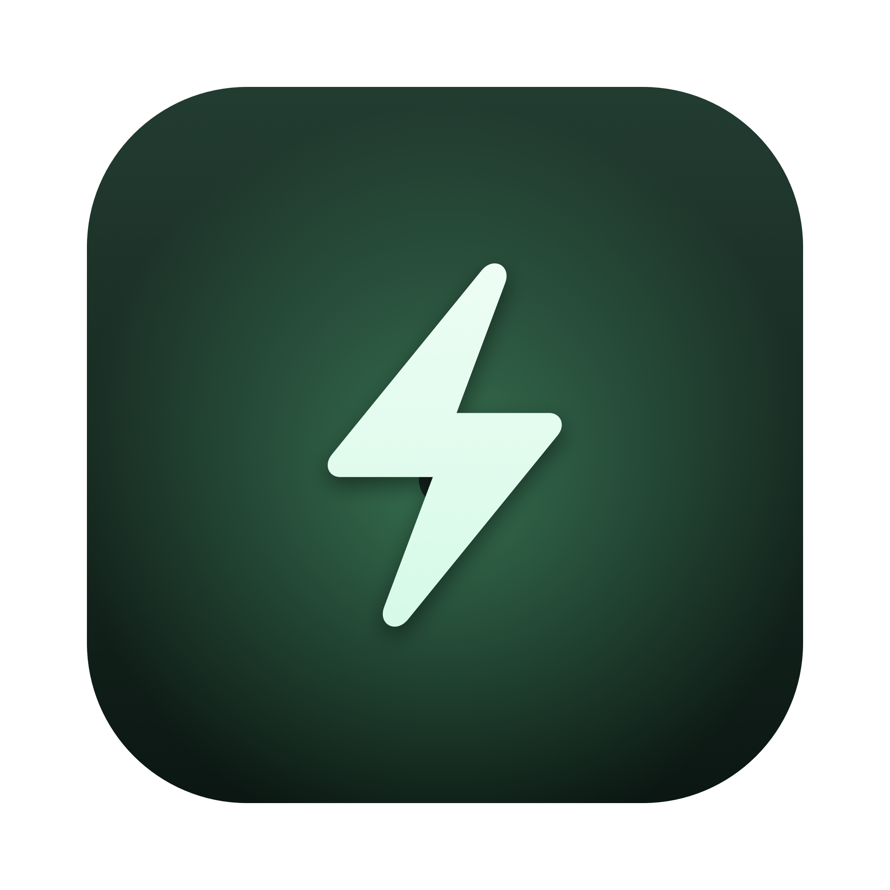
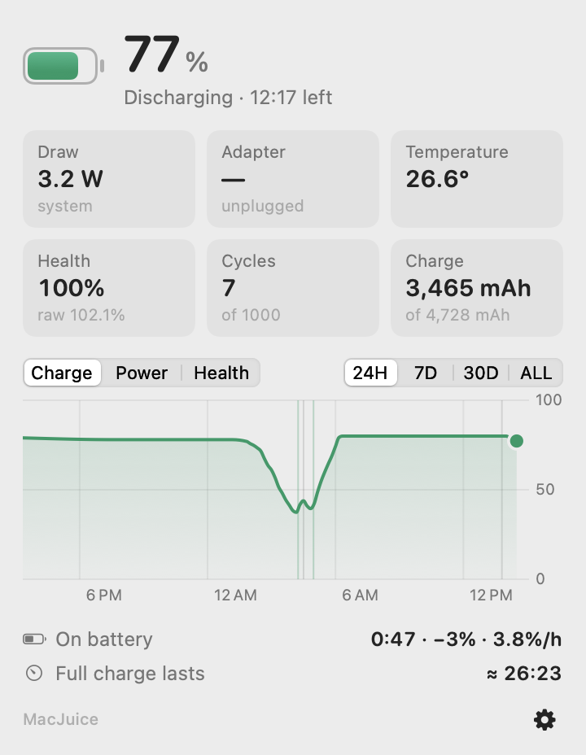

<p align="center">
  
</p>

<h1 align="center">MacJuice</h1>

<p align="center">
  A native macOS menu bar battery monitor with real history.<br>
  Live power draw in the menu bar; charge, health, temperature, sessions and
  long-term graphs one click away.<br>
  The stats coconutBattery and Battery Health charge for — free, local, no cloud.
</p>

<p align="center">
  
</p>

<p align="center">
  <picture>
    <source media="(prefers-color-scheme: dark)" srcset="docs/images/popover-dark.png">
    
  </picture>
  <br>
  <sub>(flat renders — on macOS 26+ the panel is real Liquid Glass, refracting whatever is behind it)</sub>
</p>

## What you see

**In the menu bar** — a bolt with a live number (configurable: icon only /
percentage / watts):

- on battery: system power draw ("6.6W")
- on AC: watts flowing into the battery ("+18W")

**In the panel** — one click opens a floating **Liquid Glass** panel
(real `NSGlassEffectView` lensing on macOS 26+, Control Center-style, with an
NSPopover fallback on older systems):

- Charge %, state, and time-to-empty / time-to-full
- Battery glyph that goes **yellow in Low Power Mode** and **red when low**
- Live tiles: system draw, adapter (rated + actual input watts), temperature,
  **two health numbers** (Apple's smoothed % *and* the raw mAh ratio, which can
  read >100% on a fresh battery), cycle count, current/full charge in mAh
- History charts — charge %, battery watts, or **battery health** over
  **24H / 7D / 30D / ALL**, with plug/unplug markers and hover scrubbing
- Discharge sessions ("On battery 2:04 · −11% · 5.3%/h"), time since full
  charge, and estimated full-charge runtime from your actual recent use
- Long-term capacity trend (mAh/month) once two weeks of data accumulate

**Alerts** (native notifications, each toggleable in the gear menu):

- Low battery at 20% and 10%, with the time remaining
- Fully charged — an unplug reminder
- Battery hot — sustained >40 °C

**In the gear menu** — launch at login, menu bar label style, alert toggles,
**Copy Stats** (plaintext summary to the clipboard), **Export History as
CSV**, and **high-resolution logging**: one sample every 10 s for the next
hour (stop it early from the same menu) when you want benchmark-grade data
for a specific workload.

## Built to sip power

No Python, no Electron, no subprocess spawning. One ~1.5 MB app: battery data
is read straight from IOKit (microseconds per read), history goes into SQLite,
and nothing polls faster than it has to:

| What | How often |
|---|---|
| Menu bar number | pushed by macOS power events (every % step, plug/unplug), plus a coalesced 30 s refresh while showing watts — paused when the display sleeps |
| History sample → SQLite | every ~120 s via a system-coalesced background activity, **plus instantly** on plug/unplug/full-charge so events carry exact timestamps |
| Popover while open | every 2 s |
| High-res logging (opt-in) | every 10 s, auto-stops after 1 hour |
| Popover closed | nothing |

No power assertions — the Mac sleeps exactly as it would without MacJuice.
Observed footprint: **~20 MB RSS, ~0.0% CPU**.

Because it reads IORegistry directly, it also captures what the old
text-scraping approach missed on modern macOS: true system draw
(`PowerTelemetryData.SystemLoad`, even on AC when the battery is bypassed),
battery temperature, raw capacities, and adapter details.

## Install

Requirements: Apple Silicon Mac, macOS 15+, Xcode Command Line Tools
(`xcode-select --install`).

```sh
git clone https://github.com/aakarsh-goyal/macjuice.git
cd macjuice/MacJuiceApp
./Scripts/build.sh --install     # builds, ad-hoc signs, installs to /Applications, launches
```

First launch registers **Launch at Login** (toggle it in the gear menu, along
with the menu bar label style) and asks once for notification permission (for
the battery alerts). If a database from a previous MacJuice install exists,
recording continues right where it left off.

## Your data

Everything lives in one SQLite file you own:

```
~/Library/Application Support/macjuice/battery.db
```

- `samples` — one row per reading: charge %, mAh, watts, system watts,
  temperature, voltage, amperage, health, cycles, adapter, time remaining
- `events` — `plug_in` / `unplug` / `full_charge` with exact timestamps

The schema is compatible with the original Python collector, so old history
carries over untouched. Query it with plain `sqlite3` whenever you like.

## Diagnostics

```sh
/Applications/MacJuice.app/Contents/MacOS/MacJuice --sample         # one reading as JSON
/Applications/MacJuice.app/Contents/MacOS/MacJuice --login-status   # login item state
```

## Uninstall

```sh
# quit from the gear menu first (or: pkill -x MacJuice)
rm -rf /Applications/MacJuice.app                          # removes app + login item
rm -rf "$HOME/Library/Application Support/macjuice"        # optional: erase recorded data
```

## Legacy Python version

`macjuice/` contains the original implementation this project started as — a
launchd collector plus a Flask web dashboard on `127.0.0.1:5137`, built on
`ioreg`/`pmset`/`system_profiler`. It is fully superseded by the native app
and kept for reference (its tests still pass). If its agents are installed,
`./uninstall.sh` removes them and keeps your data.

## License

Personal project. Built entirely on free macOS tooling.
